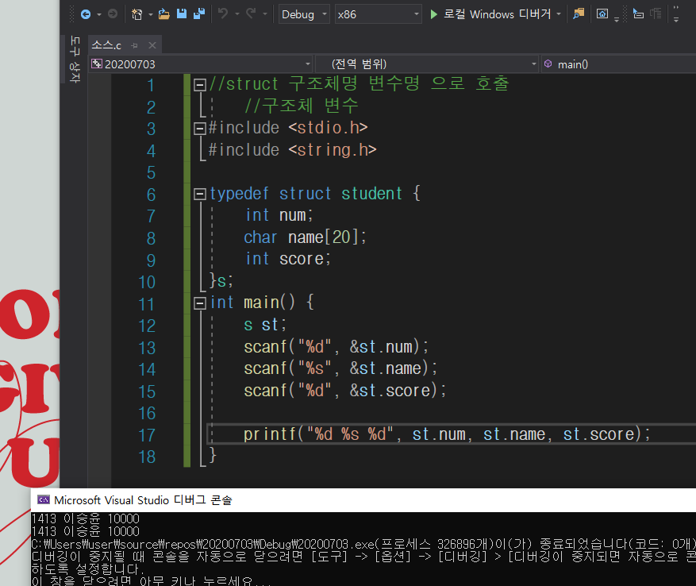
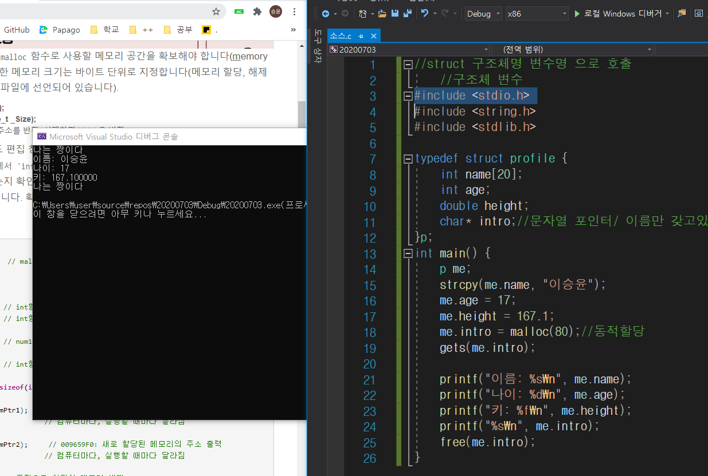

# 구조체

> 사용자 정의 자료형
>
> --> 여러 자료형을 한거번에 모아둔 것.
>
> (틀만 만들어 둠)

> 기본자료형: int, char, double,...
>
> 배열--> 같은 자료형끼리 모아둔 것.

+ 구조체 안에 구조체 가능

+ 구조체는 oop의 class와 유사함

  (구조체는 안에 변수만/ class는 안에 함수선언 가능)

+ struct 구조체 선언시,

  ​ struct 구조체명{

  ​ };

  +gets는 문자열입력받음

+ 구조체는 어렵지만 사용하면 코드작성에 용이함

+ 함수에서 구조체를 선언 할 때는 구조체인걸 티내야함

  struct student a;

  --> 구조체 student의 내용을 갖고 있는 a변수 선언;

  사용하려면

  a.num=17; strcpy(a.name); 이런식으로 해야함

+ 구조체 변수로 배열도 선언 가능

# typedef

+ typedef{

  }구조체별칭;

  하면 변수선언할 때 깔끔함

    + 구조체 별칭은 구조체 이름과 달라도 되고, 같아도 됨

+ 꼭 구조체가 아니어도

  typedef int MYINT;처럼 일반 자료형에도 사용가능함

  --> 의미를 주기 위해서

+ 구조체 별칭을 쓰면 구조체명이 없어도 됨.
+ 익명 구조체를 선언하는 경우 반드시 별칭이 있어야 함.

