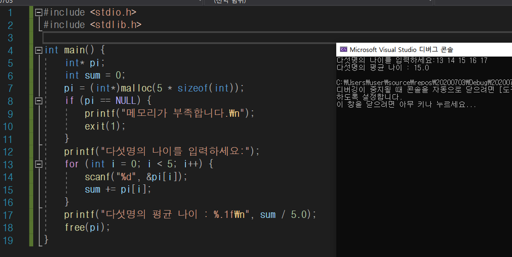

# 동적할당

정적할당 : 고정적임 / 동적할당 : 가변적임

void *malloc(unsigned int size);

: size &&바이트** 만큼 할당하고 시작위치 반환(포인터로)

> 동적으로 메모리 사용할 때 항상 포인터 사용하므로 주의
>
> -> malloc 함수 반환값이 널 포인터인지 반드시 확인 후 사용
>
>
>
> 메모리 할당 함수는 원하는 크기의 공간 할당하지 못하면 null pointer 반환함

____

### malloc, free 함수

-프로그램에 필요한 저장공간(사용자가 만듦)

​ -> 내가 만들었으니까 내가 풀어줘야 함.

-프로그램을 작성할 때 변수나 배열 선언 통해 확보

​ -> 프로그램 실행 중에 저장 공간 할당 할 수 있다.

**저장한 공간은 반드시 재활을 위해 반납해야 한다(free 함수)**

_<stdlib.h> 헤더파일_에 포함되어 있음

**(형변환)malloc(크기지정);**

~~사용하세요 사용사용~~

**free(변수명);**

____

pi = ( int* ) malloc (sizeof(int));

exit()함수는 바로 프로세스 종료.

return 은 뒤 문장을 실행하며 종료.

___

### 동적할당을 이용한 문자열 처리

**방법1. 문자열을 입력 받기 위한 충분한 크기의 문자 배열을 선언한다.**

**방법** **2. 문자열을 입력 받는다.**

**방법** **3. 입력된 문자열의 길이를 계산하여 그 크기에 맞게 기억공간을 동적으로 할당받는다.**

​     **(널문자까지 포함한 메모리를 할당하기)**

**방법** **4. 문자열을 복사한다.**

 

