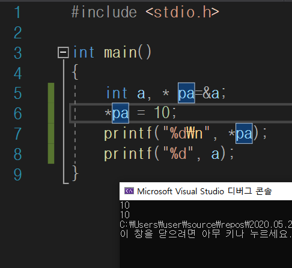
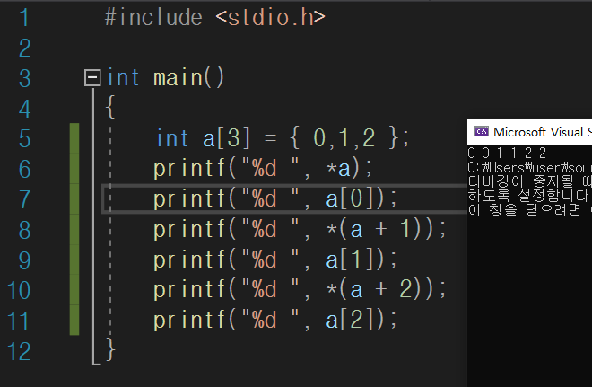

# 포인터

## 포인터를 배울 때는 마녀가 되지만 포인터를 배우고 나면 마녀의 힘을 쓸 수 있다.

## 주소연산자 &

변수 앞에 붙여서 사용하며 **할당된 메모리의 시작 주소값**을 구함

## 포인터 *

시작 주소값을 저장하는 변수이며 가리키는 자료형을 표시하여 선언

-> pa=a의 주소, *pa=a의 주소에 들어있는 값

> ex) int *pa=&a;
>
> int-> 주소를 구한 변수의 형태 (*pa가 기리키는 변수의 자료형)
>
> *->포인터
>
> pa->포인터 이름

- 포인터는 변수이므로 값을 다른 주소로 바꿀 수 있다.
- 포인터를 초기화하지 않는 것은 매우 위험하다. 이미 할당된 공간으로 초기화하기!(상수는 불가능/ 변수 가능)
- 컴파일러(운영체제)에 따라 크기가 달라질 수 있으므로 sizeof로 확인

## 배열과 포인터의 관계

-> 주소값+n은 (자료형의 크기(size of(a))) * n만큼

- 배열명 자체는 배열의 첫번째 인덱스를 가리킴
- int형 배열에서 첫번째 인덱스와 두번째 인덱스의 주소는 4만큼 차이남
- 배열명 자체가 첫번째 인덱스를 가리키므로 배열명이 가리키는 요소 값과 첫 번째 요소값이 같다

- *a=a[0]
- *(a+1)=a[1]
- *(a+2)=a[2]

