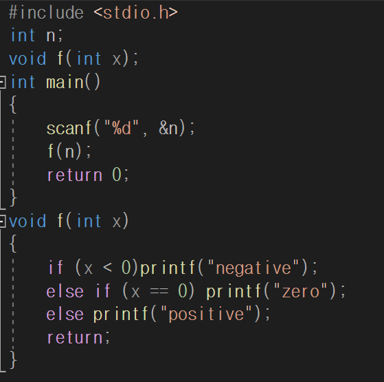

# 함수의 구성

## 함수는 제공되는 것과 사용자 정의 함수가 있다

함수는 __반환형__ __함수명__ __(매개변수)__ 로 이루어짐

+ 매개변수 선언할 때 자료형을 각각 써줘야 함
+ 반환형을 잘 확인해야함
+ 함수를 이용하여 연산도 가능

+ 가독성을 위하여 함수를 먼저 선언한뒤 main뒤에서 구현한다.
+ 지역변수를 사용할 때 같은 매개변수 이름을 사용할 수 있다
+ 자료형만 맞다면 상수를 매개변수로 넘길수도 있다.

-> 전역변수 n

__반환형이 void인 함수는 밑의 코드를 실행만 시켜줄 뿐, 값을 저장해서 반환하지는 않는다.__ return 사용하면 반환값 없이 종료!

________________

## _지역변수는 각 함수 안에서만 사용할 수 있고, 전역변수는 모든 함수에서 함께 사용할 수 있다._

-----

**변수**는 선언된 블록(영역) 안에서만 사용(접근)할 수 있는 것을 __변수의 범위(scope)__라 함

