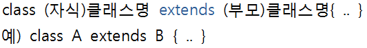

# # 객체지향 프로그래밍(OOP)

C언어는 절차지향 언어

JAVA는 객체 지향(중심) 언어

C언어는 일정 코드를 찾기 위해 일일이 읽어야 함-> 코드가 길어지면 직관성이 떨어짐

JAVA는 객체를 생성하기 때문에 C보다 코드가 길어보일 수 있지만, 객체를 구별해서 개발하기 때문에 보기에도 편리함. (간결)

> 객체지향 프로그래밍은 좀 더 나은 프로그램을 만들기 위한 프로그래밍 패러다임(틀, 체계)으로 로직을 상태와 행위로 이루어진 객체로 만드는 것이다. // 객체를 만드는 것(부품화)

____

## 객체지향의 4대 특성

하나의 프로그램이 객체를 쌓으면서 개발됨.

1. 캡슐화(정보은닉) 

   > 블랙박스처럼 만들어서 독립적으로 작동할 수 있게 하는 것

   > 멤버변수를 외부에서 접근하지 못하게 막는 것

2. 상속 : 이미 있는 기능을 사용하기 위해서 상속을 받음./ 코드를 다시 안짜도 됨.

   > 작은 레고블록을 크게 만들기 위해 작은 클래스를 기반으로 기능을 추가해서 새로운 레고블록을 만드는 방법

3. 추상화 :  실체들의 공통점을 묶어놓은 것

   + ex) 개, 고양이, 닭 --> 동물

4. 다형성 : 하나를 다양한 형태로 나타낼 수 있음

____

접근지정자 : public / private/ protected/ default

+ public: 공개 정도가 가장 높고 **어디에서든 자유롭게 접근**할 수 있다.
+ protected: **같은 패키지 내에서 접근이 가능하고 다른 패키지에서도 상속을 받은 클래스 내부에서는 사용 가능**하다. public과 다른 점은 다른 패키지의 자식 클래스 외부에서는 접근할 수 없다는 것이다.
+ default (package private) : **같은 패키지 내에서만 접근이 가능**하다. 아무런 접근 지정자도 없을 경우 이 옵션이 자동으로 적용된다.
+ private : **동일 클래스 내에서만 접근이 가능**한 가장 낮은 단계의 자유도를 갖는다.

____

## > 캡슐화 (은닉화)

: 내부의 동작 방법을 단단한 케이스 안으로 숨기고 사용자에게는 그 부품의 사용방법만을 노출하고 있는 것

> 예를 들어, 컴퓨터가 어떻게 돌아가는지 동작 원리는 모르더라도, 사용자는 컴퓨터 사용 방법만 알고 있으면 그 부품을 사용할 수 있다

____

## > 상속 

> **자식 클래스가 부모 클래스로부터 상속을 받게 되면 부모 클래스의 필드와 메소드를 물려받게 된다.** (단, 접근제어자가 private을 갖는 메소드는 상속이 불가하고, 패키지가 다를 경우 접근제어자가 default인 경우도 상속 불가능)

> 중복된 코드를 줄일수 있고, 유지보수가 편리하며, 통일성이 있고, 다형성을 구현할 수 있다.

> 부모 객체란?
>
> 상위 클래스 또는 슈퍼클래스라고도 부르는 **부모객체**

> 자식 객체란?
>
> 자식(클래스)이 상속받고 싶은 부모(클래스)를 선택해서 물려받음
>
> 하위 클래스 또는 서브 클래스라고도 함.

+ ​				==는 객체의 동일한지도 비교함. /.equals는 문자열을 비교함.//

____

## 인터페이스

> Interface,
>
> (컴퓨팅) 서로 다른 두 개의 시스템, 장치 사이에서 정보나 신호를 주고받는 경우의 **접점이나 경계면**
>
> > 컴퓨터 시스템끼리 정보를 교환하는 공유 경계

: 이질적인 것들이 결합하는 것을 막는 부품들 간의 약속

+ 하드웨어 인터페이스

  > 하드웨어간의 통신 및 상호 접속을 위한 프로토콜, 플러그, 커넥터 등

+ 소프트웨어 인터페이스

  > 소프트웨어 간의 통신을 위해 메시지를 전달하는 방식으로, 운영체제와 하드웨어/응용프로그램들 사이의 인터페이스

+ 사용자 인터페이스(User Interface)

  > 사람과 컴퓨터(시스템) 사이에서 일어나는 상호작용과 정보를 매개하는 것으로 입력과 출력을 기반으로 함

____

## 객체지향 5대 원칙 (SOLID 원칙)

#### 1. SRP(단일 책임 원칙)

> Single Responsibility Principle

: **소프트웨어의 설계 부품(클래스, 함수 등)은 하나의 책임(기능)만을 가져야 한다**

책임(기능)이 많아지면 클래스 내부의 함수끼리 강한 결합을 발생할 가능성이 높아진다

이는 유지보수 비용이 증가하게 되므로 책임을 분리시킬 필요가 있다

#### 2. OCP(개방-폐쇄 원칙)

> Open-Close Principle

: **기존의 코드를 변경하지 않고(Closed) 기능을 수정하거나 추가할 수 있도록(Open) 설계해야 한다**

자주 변경되는 내용은 수정하기 쉽게 설계하고, 변경되지 않아야 하는 것은 수정되는 내용에 영향을 받지 않게하는 것이 포인트! 이를 위해 자주 사용되는 문법이 **인터페이스**이다

> 자주 변경되는 것을 인터페이스로 정의만 해놓고 수정될 때는 재정의를 새롭게 하면 됨

OCP를 만족한 설계는 변경에 유연하므로 유지보수 비용을 줄여주고 코드의 가독성 또한 높아지는 효과를 준다

#### 3. LSP(리스코프 치환 원칙)

> Liskov Substitution Principle

: **자식 클래스는 부모클래스에서 가능한 행위를 수행할 수 있어야 한다**

부모 클래스와 자식 클래스 사이의 행위에는 일관성이 있어야 한다는 원칙이며, 이는 객체 지향 프로그래밍에서 부모 클래스의 인스턴스 대신 자식 클래스의 인스턴스를 사용해도 문제가 없어야 한다는 것을 의미한다

> 상속 관계에서는 일반화 관계(IS-A, 일관성이 있는 관계)가 성립해야 한다

따라서 리스코프 치환 원칙은 일반화 관계에 대해 묻는 것이라 할 수 있다

#### 4. ISP(인터페이스 분리 원칙)

> Interface Segregation Principle

:**한 클래스는 자신이 사용하지 않는 인터페이스는 구현하지 말아야 한다. 하나의 일반적인 인터페이스보다는, 여러개의 구체적인 인터페이스가 낫다**

이는 자신이 사용하지 않는 기능(인터페이스)에는 영향을 받지 말아야 한다는 의미이다

#### 5. DIP(의존 역전 원칙)

> Dependency Inversion Principle

: **의존 관계를 맺을 때, 변화하기 쉬운것 보단 변화하기 어려운 것에 의존해야 한다는 원칙**

여기서 말하는 변화하기 쉬운 것이란 구체적인 것(구체화된 클래스)을 말하고, 변화하기 어려운 것이란 추상적인 것(추상 클래스, 인터페이스)을 말한다. 

따라서 DIP를 만족한다는 것은 의존 관계를 맺을 때, 구체적인 클래스보다 **인터페이스나 추상 클래스와 관계를 맺는다**는 것을 의미한다