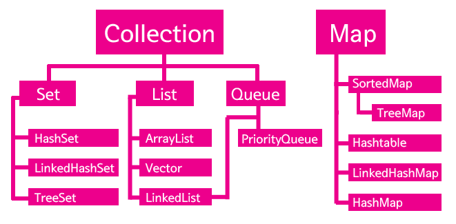

# Collections Framework


### 배열과 컬렉션즈 프레임워크

배열은 연관된 데이터를 관리할 수 있지만, 한번 정해진 배열의 크기는 변경할 수 없다는 단점이 있다. 이러한 불편함은 컬렉션즈 프레임워크를 사용하면 줄어든다.

배열은 그 크기를 한번 지정하면 크기보다 많은 수의 값을 저장할 수 없다.

```java
String[] arr = new Strnig[2];
arr[0] = "one";
arr[1] = "two";
//arr[2] = "three"; 오류 발생함
```

하지만 ArrayList는 크기를 미리 지정하지 않기 때문에 얼마든지 많은 수의 값을 저장할 수 있다.

```java
ArrayList al = new ArrayList();
al.add("one");
al.add("two");
al.add("three");
```

ArrayList는 배열과는 사용방법이 조금 다르다. 배열의 경우 값의 개수를 구할 때 `.length`를 사용했지만 ArrayList는 `size`를 사용한다. 또한, 특정한 값을 가져올 때 배열은 [인덱스 번호]를 사용했지만 컬렉션은 `.get(인텍스 번호)`를 사용한다.


ArrayList의 메소드 add의 입장에서는 인자로 어떤 형태의 값이 들어올 지 알 수 없다. 그렇기 때문에 모든 데이터 타입의 조상인 Object 형식으로 데이터를 받고 있다.

따라서 ArrayList 내에서 add를 통해서 입력된 값은 Object의 데이터 타입을 가지고 있고, get을 이용해서 이를 꺼내도 Object의 데이터 타입을 가지고 있게 된다.


### 전체적인 구성



컬렉션즈 프레임워크라는 것은 다른 말로는 컨테이너라고도 부른다. 즉 값을 담는 그릇이라는 의미이다. 그런데 그 값의 성격에 따라서 컨테이너의 성격이 조금씩 달라진다. 자바에서는 **다양한 상황에서 사용할 수 있는 다양한 컨테이너를 제공**하는데 이것을 컬렉션즈 프레임워크라고 한다. 그 중 하나인 ArrayList를 찾아보면 List`인터페이스`라는 성격으로 분류되고 있다는 것을 알 수 있다.


### List와 Set의 차이점

List는 중복을 허용하고 저장되는 순서가 유지되지만, Set은 중복을 허용하지 않고 순서가 없다.


### Map

Map은 Key와 Value의 쌍으로 값을 저장하는 컬렉션이다.

```java
HashMap<String,Integer> a = new HashMap<String, Integer>();
a.put("one",1);
a.put("two",2); //key를 이용해서 값을 가져올 수 있다.
System.out.println(a.get("one")); //1
```


### 정렬

컬렉션을 사용하는 이유 중의 하나는 정렬과 같은 데이터와 관련된 작업을 하기 위해서이다. `java.util`안에 있는 클래스 `Collectors`는 다양한 클래스 메소드를 가지고 있다. 메소드 sort는 그 중의 하나로 List의 정렬을 수행한다. 

```java
public static <T extends Comparable<? super T>> void sort(List<T> list)
```

sort의 인자인 list는 데이터 타입이 `List`이다. 즉 메소드 sort는 List 형식의 컬렉션을 지원한다. 인자 list의 제네릭 `<T>`는 coparable을 extends하고 있어야 한다. Comparable은 인터페이스인데 이를 구현하고 있는 클래스는 다음 메소드를 가지고 있어야 한다. -> `compareTo(T o)`  


컬렉션즈 프레임워크는 효율적인 애플리케이션을 구축하기 위해 매우 중요한 내용이다. 그런데 컬렉션은 단순히 사용법을 이해하는 것으로는 부족하고, 알고리즘이나 자료구조라고 불리는 분야에 대한 충분한 이해가 필요하다. 컬렉션즈 프레임워크는 이러한 분야의 성취를 누구나 쉽게 사용할 수 있도록 제공되는 일종의 라이브러리라고 할 수 있기 때문이다.


[생활코딩 Collections Framework](https://opentutorials.org/course/1223/6446)